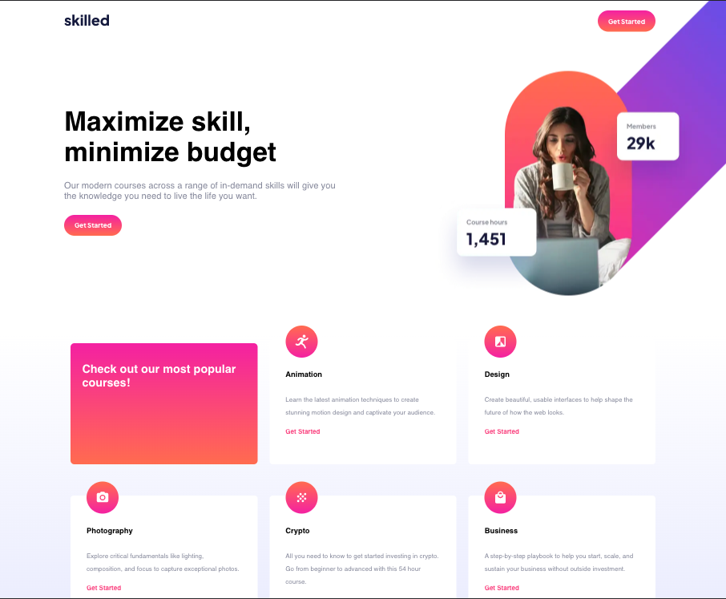

# Frontend Mentor - Skilled e-learning landing page solution

This is a solution to the [Skilled e-learning landing page challenge on Frontend Mentor](https://www.frontendmentor.io/challenges/skilled-elearning-landing-page-S1ObDrZ8q).

## Table of contents

- [Overview](#overview)
  - [The challenge](#the-challenge)
  - [Screenshot](#screenshot)
  - [Links](#links)
- [My process](#my-process)
  - [Built with](#built-with)
  - [What I learned](#what-i-learned)
  - [Continued development](#continued-development)
  - [Useful resources](#useful-resources)
- [Author](#author)

### Screenshot



- Solution URL: [Add solution URL here](https://your-solution-url.com)
- Live Site URL: [Add live site URL here](https://your-live-site-url.com)

## My process

### Built with

- Semantic HTML5 markup
- CSS custom properties
- Flexbox
- CSS Grid
- Mobile-first workflow

### What I learned

I really got to sitdown and think about the z-index property, how it functions, and how it's related to the elements' 'position,' etc. I also practiced Grid and Flexbox.

Here's some HTML

```<div class="upper-section">
<div class="title-n-stuff">
  <h1>Maximize skill, <br> minimize budget</h1>
  <p>Our modern courses across a range of in-demand skills will give you the
           knowledge you need to live the life you want.</p>
           <button>Get Started</button>
</div>
        
        
        
    </div>
```

### Continued development

I'm proceeding with the Front

### Useful resources

- FreeCodeCamp Article on Z-index [https://www.freecodecamp.org/news/z-index-in-css-what-it-is-and-what-it-does/#:~:text=What%20is%20a%20Z%20Index,%2C%20or%20position%3Afixed%20).](

## Author

- Youtube - [potb_tech]
- Frontend Mentor - [@peteonthebeat]
- Instagram - [@potb_tech]

## Acknowledgments

Shout outs to my girl for suggesting me to consider using z-index and position on the 'desktop hero-image.'
